# TP1 - Git & Docker - Rapport

## Informations

* Nom du projet : `sentiment-ai`
* Outils utilisés :

  * Git
  * GitHub
  * Docker
  * Docker Compose
  * VS Code
  * Python 3.11
  * FastAPI

---

# Captures d'écran à fournir

## Capture 1 - Premier commit Git


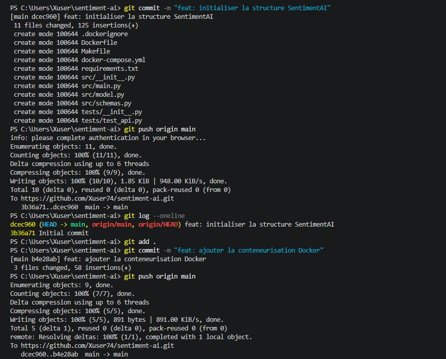

---

## Capture 2 - Build Docker réussi

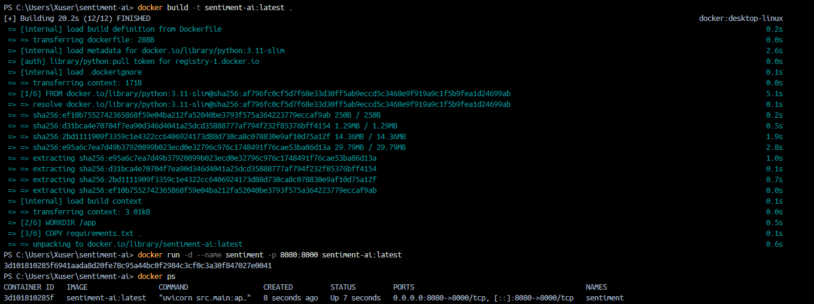

---

## Capture 3 - Test de l'API

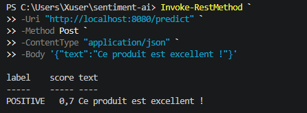

---

## Capture 4 - Docker Compose

Commande :

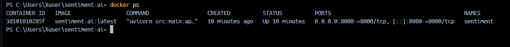

---

## Capture 5 - Tests automatisés

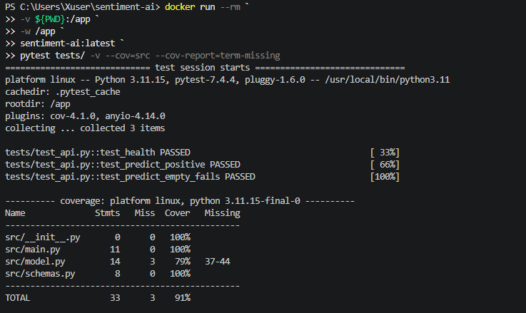

---

## Capture 6 - Tag Git

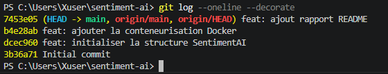

---

# Réponses aux questions

## Question 1.1

### Quel est le rôle du fichier `.gitignore` ?

Le fichier `.gitignore` permet d'exclure certains fichiers et dossiers du suivi Git. Il évite d'ajouter au dépôt des fichiers temporaires, générés automatiquement ou spécifiques à l'environnement local du développeur.

### Pourquoi ne pas committer `__pycache__/` ?

Le dossier `__pycache__/` contient des fichiers Python compilés automatiquement. Ces fichiers peuvent être recréés à tout moment et n'apportent aucune valeur au code source. Les versionner alourdirait inutilement le dépôt Git.

---

## Question 1.2

### Différence entre `git add .` et `git add -p`

`git add .` ajoute l'ensemble des modifications au staging.

`git add -p` permet de sélectionner les modifications bloc par bloc avant leur ajout au staging.

### Quand utiliser `git add -p` ?

Cette commande est particulièrement utile lorsqu'un même fichier contient plusieurs modifications indépendantes. Elle permet de créer des commits plus propres et plus faciles à relire.

---

## Question 2.1

### Couches mises en cache et recalculées

Lors du premier build Docker, toutes les couches sont construites.

Lors des builds suivants, Docker réutilise les couches inchangées grâce à son système de cache.

Les couches correspondant à :

```dockerfile
COPY requirements.txt .
RUN pip install --no-cache-dir -r requirements.txt
```

restent généralement en cache tant que le fichier `requirements.txt` n'est pas modifié.

Les couches associées à la copie du code source sont reconstruites lorsqu'un fichier Python est modifié.

---

## Question 2.2

### Que remarque-t-on lors du second build ?

La majorité des étapes apparaissent avec la mention `CACHED`, ce qui accélère fortement le build.

### Quelle instruction ne bénéficie plus du cache après modification d'un fichier Python ?

```dockerfile
COPY src/ ./src/
```

Cette couche est invalidée dès qu'un fichier du dossier `src/` est modifié.

### Pourquoi ?

Docker fonctionne avec un système de couches (layers). Lorsqu'une couche change, toutes les couches suivantes doivent être reconstruites afin de garantir la cohérence de l'image.

---

## Question 3.1

### Utilité d'un healthcheck

Le healthcheck permet à Docker de vérifier périodiquement que l'application fonctionne correctement.

Si l'application ne répond plus alors que le conteneur est toujours démarré, Docker peut détecter l'anomalie et signaler le service comme `unhealthy`.

Dans un contexte CI/CD ou d'orchestration, cela permet d'éviter qu'une application défaillante continue à recevoir du trafic utilisateur.

---

## Question 4.1

### Résultat des tests

Les trois tests ont été exécutés avec succès :

* test_health
* test_predict_positive
* test_predict_empty_fails

Le taux de couverture obtenu est visible dans le rapport généré par `pytest-cov`.

---

## Question 4.2

### Différence entre un tag annoté et un tag léger

Un tag léger est simplement un pointeur vers un commit.

Exemple :

```bash
git tag v0.1.0
```

Un tag annoté contient en plus :

* le nom du créateur ;
* la date de création ;
* un message descriptif.

Exemple :

```bash
git tag -a v0.1.0 -m "Initial SentimentAI release"
```

### Pourquoi utiliser des tags annotés en production ?

Les tags annotés améliorent la traçabilité des versions livrées. Ils permettent d'identifier précisément qui a créé une version, quand elle a été créée et pour quelle raison.


---
---
---


# TP2 – Mise en place d'une pipeline CI/CD avec Jenkins

## Objectif

L'objectif de ce TP est d'automatiser les différentes étapes du cycle de vie de l'application Sentiment-AI grâce à Jenkins.

La pipeline doit permettre :

* La récupération automatique du code source depuis GitHub.
* La vérification de la qualité du code (Lint).
* La construction de l'image Docker.
* L'exécution des tests automatisés.
* Le déploiement de l'image sur un registre de conteneurs.

---

## 1. Préparation de l'environnement

### Installation de Jenkins

Création d'une image Jenkins personnalisée contenant :

* Git
* Docker CLI

Création du fichier :

`Dockerfile.jenkins`

```dockerfile
FROM jenkins/jenkins:lts

USER root

RUN apt-get update && \
    apt-get install -y docker.io git && \
    apt-get clean

USER jenkins
```

Construction de l'image :

```bash
docker build -t my-jenkins -f Dockerfile.jenkins .
```

Lancement du conteneur Jenkins :

```bash
docker run -d \
--name jenkins \
-p 8081:8080 \
-p 50000:50000 \
-v jenkins-data:/var/jenkins_home \
-v //var/run/docker.sock:/var/run/docker.sock \
my-jenkins
```

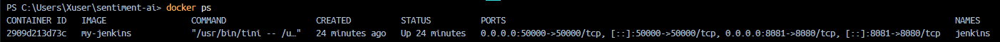

---

## 2. Création du Pipeline

Création d'un Pipeline Jenkins nommé :

```text
sentiment-ai-pipeline
```

Configuration :

* Pipeline script from SCM
* SCM : Git
* Repository URL : dépôt GitHub du projet
* Branch : */main
* Script Path : Jenkinsfile

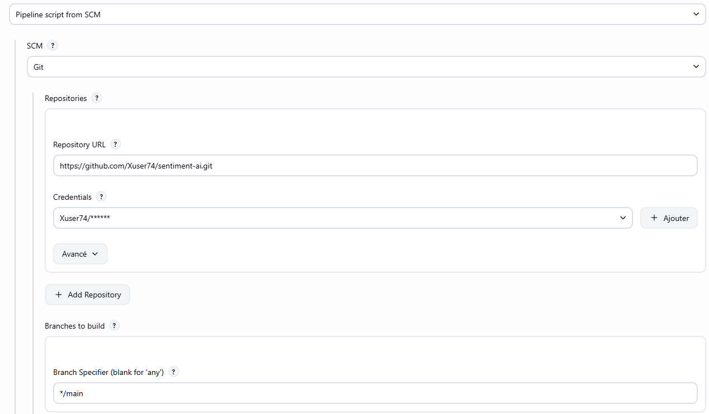

---

## 3. Création du Jenkinsfile

Le Jenkinsfile contient plusieurs stages :

### Checkout

Récupération du projet depuis GitHub.

### Lint

Analyse statique du code avec flake8.

### Build & Test

Construction de l'image Docker puis exécution des tests unitaires.

### Push

Publication de l'image Docker sur le registre GitHub Container Registry.


---

## 4. Exécution de la pipeline

Lancement manuel du job Jenkins.

Les étapes exécutées sont :

1. Checkout
2. Lint
3. Build & Test
4. Push

Chaque étape est exécutée automatiquement par Jenkins.

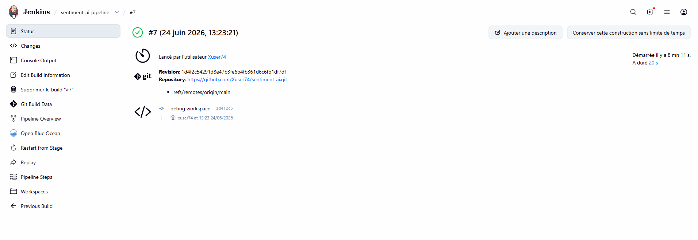

---


## 6. Validation de l'image Docker

Vérification de la présence de l'image générée :

```bash
docker images
```

Image présente :

```text
sentiment-ai
```

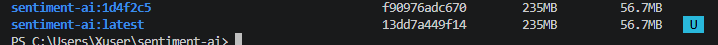

---

## 7. Validation de l'API

Test de l'API après le déploiement.

Commande utilisée :

```powershell
curl.exe -X POST "http://localhost:8080/predict" -H "Content-Type: application/json" -d "{\"text\":\"Ce produit est excellent !\"}"
```

Résultat :

```json
{
  "sentiment": "positive"
}
```

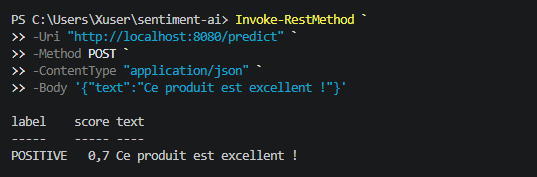

---

## Questions

### Quel est le rôle de Jenkins ?

Jenkins est un serveur d'intégration continue permettant d'automatiser les tâches liées au développement logiciel comme la compilation, les tests, l'analyse de code et le déploiement.

### Qu'est-ce qu'une pipeline CI/CD ?

Une pipeline CI/CD est une chaîne automatisée permettant d'intégrer, tester et déployer une application à chaque modification du code source.

### Pourquoi utiliser Docker dans la pipeline ?

Docker garantit un environnement identique entre le développement, les tests et la production, ce qui améliore la reproductibilité et réduit les erreurs liées à l'environnement.

### Quel est l'intérêt des tests automatisés ?

Les tests automatisés permettent de détecter rapidement les régressions et de garantir le bon fonctionnement de l'application après chaque modification.

### Pourquoi stocker le Jenkinsfile dans Git ?

Le Jenkinsfile permet de versionner l'infrastructure CI/CD avec le code de l'application afin de garantir la reproductibilité de la pipeline.

---


